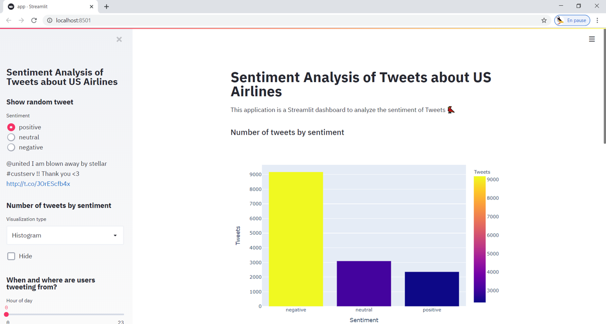
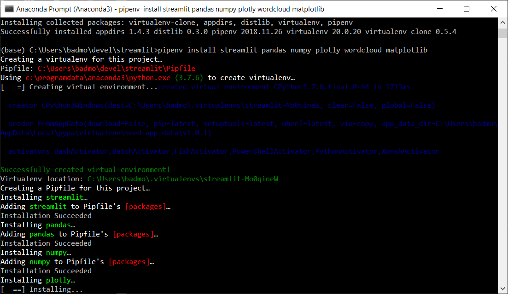
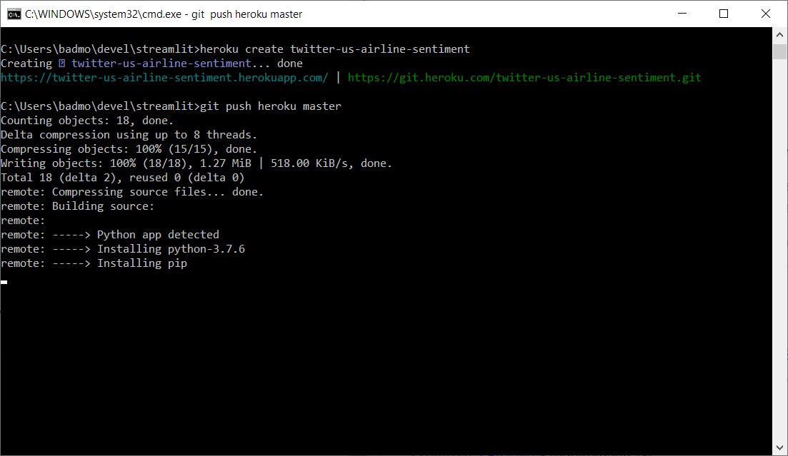

# streamlit [](https://share.streamlit.io/slevin48/streamlit/app.py)
A crash course to streamlit dashboard with a Twitter sentiment analysis + deployment on Heroku



The dataset is coming from this Kaggle contest on the analysis of **Twitter US Airline Sentiment**:
https://www.kaggle.com/crowdflower/twitter-airline-sentiment

A Notebook handling this problem with Jupyter:
https://github.com/ireneliu521/Twitter-US-Airline-Sentiment_J2D_Project_Python/blob/master/Twitter%20US%20Airline%20Sentiment.ipynb

## Development

Using [pipenv](https://pipenv.pypa.io/)



## Deployment

Video tutorial: https://www.youtube.com/watch?v=skpiLtEN3yk
Associated blogpost: https://blog.jcharistech.com/2019/10/24/how-to-deploy-your-streamlit-apps-to-heroku/

```
heroku login
```
```
heroku create
```
[Deploy the app](https://devcenter.heroku.com/articles/getting-started-with-python#deploy-the-app):
```
git push heroku master
```

### Required files
1. setup.sh
2. [Procfile](https://devcenter.heroku.com/articles/procfile)
3. requirements.txt


